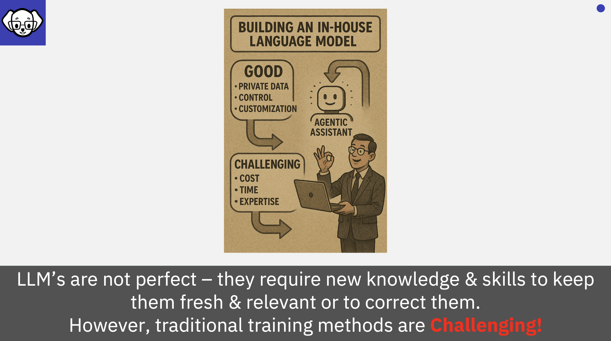

# Imagine how businesses would benefit from having their own customised LLMs!
    

---

Imagine a business wants to harness the full value of its internal data by building its own proprietary, **in-house LLM**. Fortunately, they don't need to start from scratch. With the growing ecosystem of open-source models available on platforms like Hugging Face, companies can fine-tune an existing model to suit their specific needs.

This custom LLM could become a 'golden egg', the organisations 'font of knowledge' - a central source of knowledge and capability that empowers employees with instant access to company-specific expertise, streamlines internal processes, and provides valuable insights into customer behavior and operational efficiency. In short, it could become a powerful source of institutional intelligence.

But where do organisations begin? 
Isn't this expensive? 
Who has the necessary expertise? 
And how do they ensure they,re doing it right?

The reality is, building and evolving an LLM comes with significant challenges.

---

---

Importantly, most organizations don't need a massive model like ChatGPT, which is trained on approximately 1.8 trillion tokens. Instead, they benefit more from a focused, domain-specific model; something with a solid foundation in general knowledge, but tailored with their industry and organisational data, knowledge, and skills. After all, a mortgage provider doesn't need deep expertise in marine biology.

Smaller, specialized LLMs are not only more practical, but also more efficient. A compact model offers several advantages:
- Lower inference costs
- Reduced carbon footprint
- Faster training with less computational overhead
- Easier deployment and maintainability

By narrowing the scope, companies can build smarter, more sustainable models that deliver real value without unnecessary complexity.
