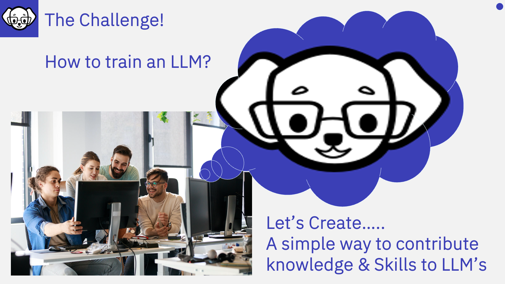
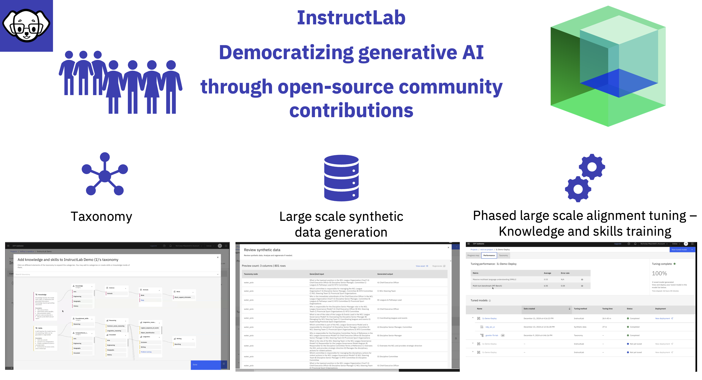

# Introducing InstructLab

---

Traditional methods for training an LLMs are labourious, time consuming, and complicated.  So the research team at IBM's Cambridge AI Model Research Lab - devised a new Methodology, called the Large-Scale Aulignment for ChatBots or LAB Method (which we will look at later) to enable anyone to contribute knowledge and skills to an LLM!

---

---

InstructLab had democratising the alignment tuning of LLM's enabling anyone to be able to contribute knowledge and skills. InstructLab has also been developed by RedHat and is today available with an Apache 2.0 licence as open source software on GitHub, where you can not only contribute to the development of InstructLab, but more importantly anyone can use it to contribut to public or private LLM's.

## Why is this important

:bulb:Large Language Models (LLMs) are the new frontier in data insights, but they are only as knowledgeable as the information they contain. We live in a data-driven world, where new information is generated every second. For organizations and enterprises, data is stored internally, meaning that to fully leverage an LLM, these organizations need to integrate their proprietary data into their private LLM. However, customizing or tailoring LLMs has been a significant and costly challenge. :bulb:This is where InstructLab comes in to overcome that challenge enabling organisations and individuals to **customize LLMs** for business needs, at a much **lower cost**.

InstructLab enables a prescriptive approach to LLM development, allowing individuals to define what a model knows and what it can do using a taxonomy.

Prior to InstructLab, new knowledge could only be added to a model via Fine Tuning, which is costly and resource intensive. To address this, InstructLab **democratizes** model tuning and provides a **multi-phased, large-scale alignment tuning process** that enables you to **integrate knowledge that you Synthetically Generate**.

InstructLab is an **open-source project**, which means not only can anyone contribute to its development, but you can also play a part in the ongoing evolution of LLMs in a controlled and governed manner.

Before we dive into the details of InstructLab, let’s explore how we got here!
