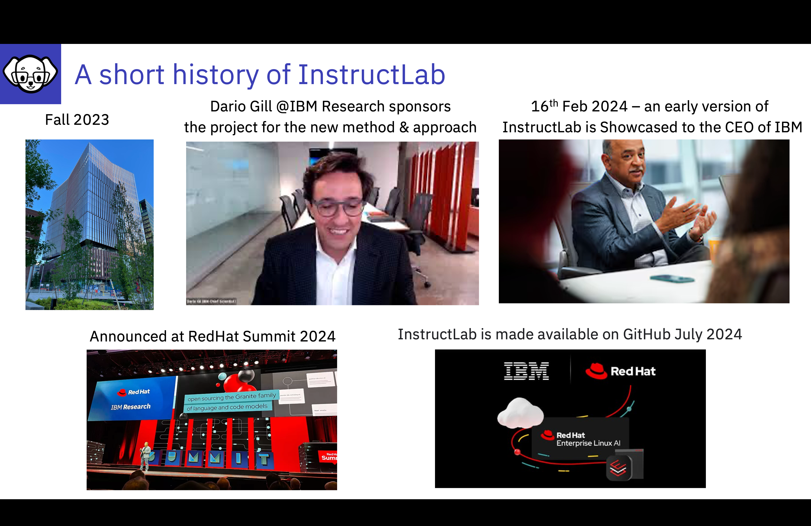

# History of InstructLab

From IBM Research to RedHat and the world of Open Source

---

The InstructLab Technique was developed by the team at Cambridge AI Model Research in the fall of 2023. Dario Gill, Head of IBM Research, quickly recognized the potential of this innovative methodology for tuning large language models. Enthusiastic about its possibilities, Dario presented the technique to Arvin and his senior leadership team on February 16th of this year. The response was overwhelmingly positive, with excitement about how Instruct Lab could enhance both IBM models and the broader open model's ecosystem.

IBM Research Project Published March 2024
“LAB: Large-Scale Alignment for ChatBots”, authored by Shivchander Sudalairaj, Abhishek Bhandwaldar, Aldo Pareja, Kai Xu, David D. Cox, Akash Srivastava 
https://arxiv.org/abs/2403.01081

Project Presented to IBM and Red Hat Senior Executives
Decision made to release the innovation as an open-source project as soon as possible

Creation of a new development team of the original researchers and elite open-source contributors from IBM Research and Red Hat

Creation of InstructLab open source project with a command line interface, refined taxonomy model, CI/CD, governance docs, CoC docs, and getting started docs

This momentum was further accelerated with support from RedHat, leading to a joint announcement at the RedHat Summit, in early May 2024

Today InstructLab is available as an open-source offering for all to use to add/tune models.  Or for individuals to contribute to the development of InstructLab.

The focus of InstructLab is to democratize the modification of Foundation Models through this community driven initiative. 

