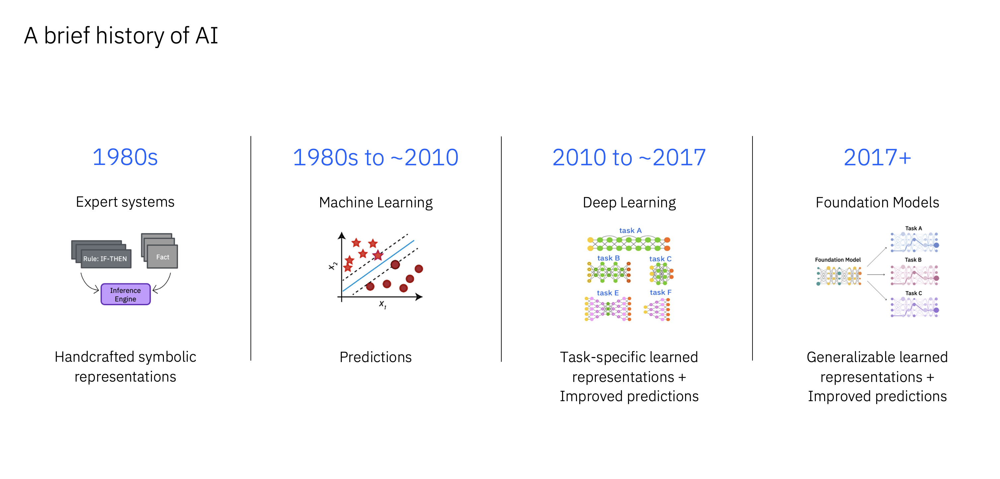
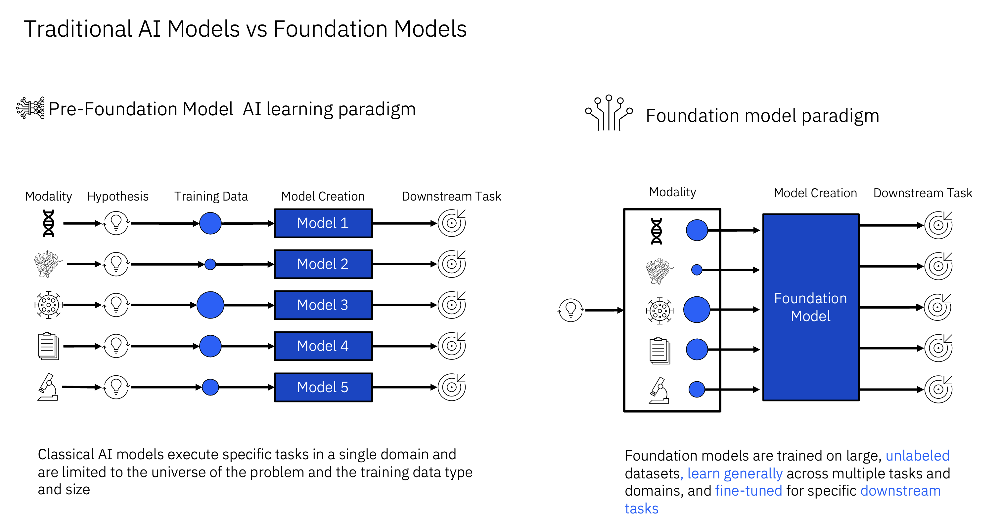

# A brief history of AI

*Please note: machine learning algorithums date back to before the 1980's.  "Alan Turing gave quite possibly the earliest public lecture (London, 1947) to mention computer intelligence, saying, “What we want is a machine that can learn from experience,” and that the “possibility of letting the machine alter its own instructions provides the mechanism for this.” In 1948 he introduced many of the central concepts of AI in a report entitled “Intelligent Machinery.” [link](https://www.britannica.com/science/history-of-artificial-intelligence)*

## What are Large Language Models ? 

Let’s start by getting a high-level overview of what LLMs (a subset of foundation models) are and why they are relevant today.

AI has evolved from ruled-based expert systems to machine learning models, such as support vector machines and tree-based models, that are able to learn patterns in the data and make predictions. 

Machine learning models were then followed by Neural Networks and Deep Learning models.

These models mimic human brain functions, can learn representations from vast amounts of data where these representations are task specific.
and can provide more accurate predictions. 

In 2017, Google presented at Neurips a paper called “Attention is all you need” that introduce a new complex neural network architecture called “transformer” with an attention mechanism. Since then FMs emerged as a new paradigm for building AI systems that can learn powerful and generalizable representations and therefore are able to provide improved predictions.

---

---

## The main difference between pre-gen AI models and foundations models. 

Classical AI models are trained to perform specific tasks using specific datasets/studies and even though they can achieved impressive predictive performance for specific use cases and dataset they tend to overfit to the training data. 

This results in models with high predictive performance on the specific dataset used for the development of the model but poor predictive performance when applied to new, unseen data. 

Many traditional AI models in fact fail to generalize well across different domains, populations, or clinical contexts. 

This has highlighted the need for more robust and flexible approaches, such as Foundation models, that can learn generally from large unlabelled datasets of multiple modalities and can be then fine-tuned to specific downstream tasks.

Contributor: [Matthew Madgwick](https://www.linkedin.com/in/matthewjmadgwick/)
