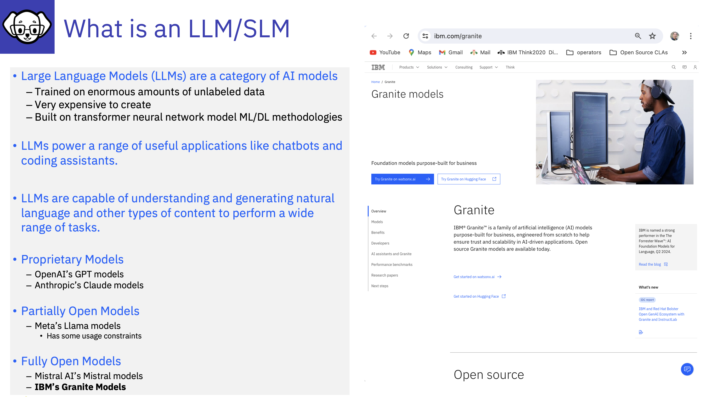

# What is an LLM / SLM

Let's start by understanding more about Language Model (LLMs) and Small Language Models (SMLs). 

---

# Let's see what ChatGPT has to say about LLMs!

Of course, ChatGPT is not the only LLM, however, it was the first one release commercially!

---

# Small Language Models (SLMs)

"Small language models (SLMs) are artificial intelligence (AI) models capable of processing, understanding and generating natural language content. As their name implies, **SLMs are smaller in scale and scope than large language models (LLMs)**."

Quote by Rina Diane Carallar full article can be found [here](https://www.ibm.com/think/topics/small-language-models#:~:text=Small%20language%20models%20(SLMs)%20are,large%20language%20models%20(LLMs).)

Small Language Models although they contain less information are often focused on a specific field or set of topics.  Due to their smaller nature, they can be much more efficient to work with.   The Granite model uses 97% less energy than the largest LLMs, and is designed to be small and for purpose, containing curated information. 

In 2025 Small Language Models, have become more prevalent in the market.  They provide many benefits, such as lower costs for inferencing, requiring less compute power, being focused on specific topics. **DeepSeek**, notably came into the spotlight at the start of 2025 showing that a small LLM can be very impactful!

LLMs have predominantly been trained with publicly available information, however, they have not been trained with data from organisations, so they do not bring their benefits to organisations, without being augmented or trained which can be costly. 

If you want to find out more about an SSL - Check out Granite - IBM’s **open source based family of LLMs** at https://www.ibm.com/granite 

