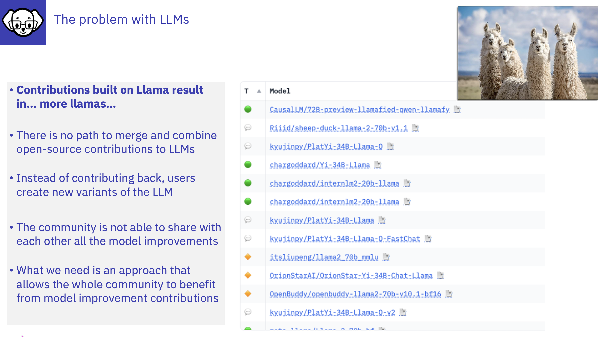

# The issues with LLMs

---
# The LLM challenge: Low-quality data to build LLMs

As the competition in the LLM space intensifies, the approach seems to be to build increasingly massive models trained from vast amounts of information from the public internet. However, large parts of the internet include redundant information or non-natural language data that does not contribute to the model's core functionality.

For instance, 80% of tokens used to train the LLM GPT-3, upon which later versions are built, originates from Common Crawl, which includes an enormous array of web pages. This dataset is known to contain a mix of high-quality text, low-quality text, scripts and other non-natural language data. It is estimated that a significant fraction of the data may be non-useful or low-quality content. (Common Crawl Analysis)

Taken from ["how InstructLab's synthetic data generation enhances LLMs"](https://www.redhat.com/en/blog/how-instructlabs-synthetic-data-generation-enhances-llms)

by [Cedric Clyburn](https://www.redhat.com/en/authors/cedric-clyburn) and [Legare Kerrison](https://www.redhat.com/en/authors/legare-kerrison)

---
# Comparison of LLMs and SLMs

| Attribute | LLM | SLM | 
| --- | --- | --- |
| Typical Size | Billions to trillions of parameters| Few million to several billion parameters|
| Accessibility | Require multiple GPUs | Require less GPUs |
| Latency | Higher | Lower |
| Sustainability |Higher Carbon Footprint| Lower Carbon Footprint|
| Typical Content | Scraped from the internet and all available sources | Typically specifically curated |
| Uses | General and specific| General and specific |
| Time to train | ~Weeks to months | ~Hours to weeks|

# The Challenges of LLMs - maintaining and training
From the short list of comparisons you can understand why training large language models (LLMs) is expensive due to the immense computational resources, large amounts of data, and specialized expertise required. These factors contribute to high infrastructure costs, data acquisition and preparation expenses, and the salaries of the highly skilled personnel involved. 

:bulb: *To Train an open source LLM in a traditional manner the primary challenge is cost of computing resourses and skills!*
  

