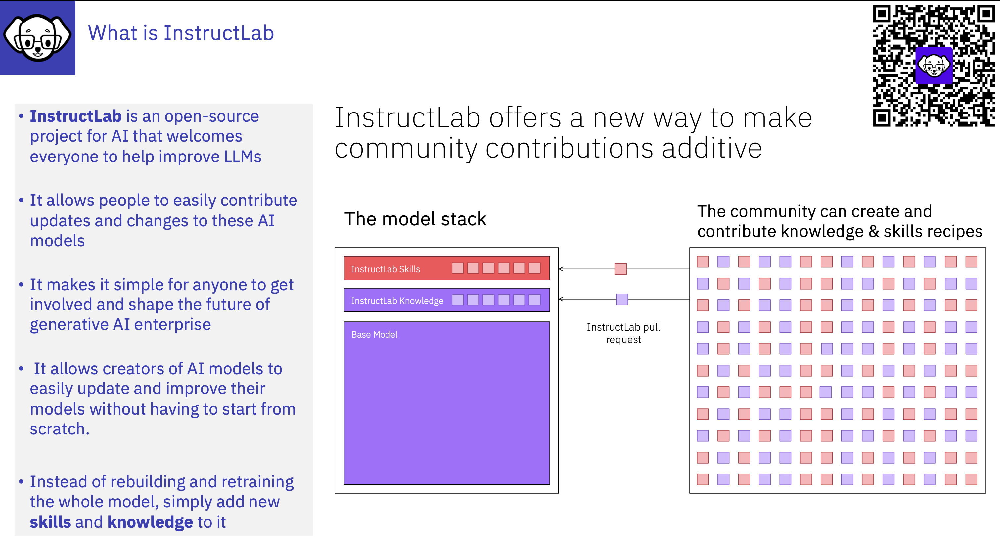
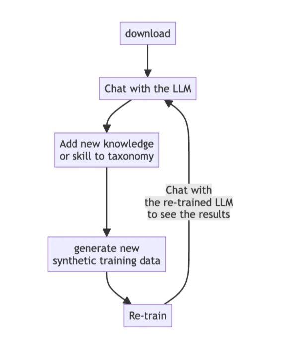
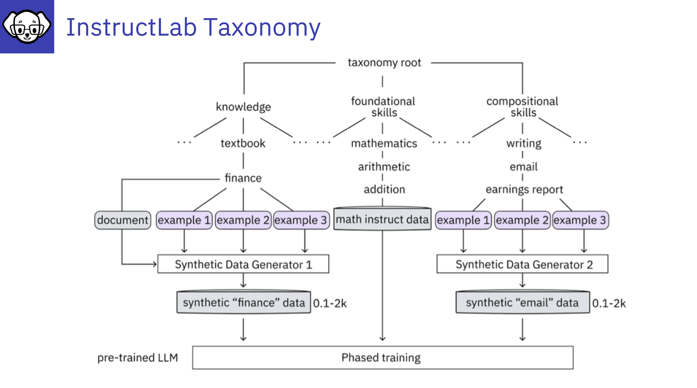

# InstructLab and how it helps

:bulb:
InstructLab is an **open-source project** originating from IBM Research and Red Hat that enables **community-driven customization and tuning of large language models (LLMs)** for generative AI applications, focusing on **accessibility, cost-effectiveness, and providing a broader coverage of target tasks** . It **democratizes model tuning** and drive community development of LLMs and for businesses, enabling them to easily customise their in house LLM!

---

# What you can do with InstructLab

---

# InstructLab Taxonomy Overview

InstructLab is an open source project for enhancing large language models (LLMs) used in generative artificial intelligence (gen AI) applications. Created by IBM and Red Hat, the InstructLab community project provides a cost-effective solution for improving the alignment of LLMs and opens the doors for those with minimal machine learning experience to contribute.

InstructLab, offers developers a powerful toolset to enhance Large Language Models (LLMs) for specific business needs. By addressing the challenges of fine-tuning and deploying LLMs, InstructLab streamlines the training process through taxonomy-driven data curation, large-scale synthetic data generation, and a multi-phased instruction-tuning framework.

## The LAB method consists of 3 components:
- **Taxonomy-driven data curation** Taxonomy is a set of diverse training data curated by humans as examples of new knowledge and skills for the model.
- **Large-scale synthetic data generation** The model is then used to generate new examples based on the seed training data. Recognizing that synthetic data can vary in quality, the LAB method adds an automated step to refine the example answers, making sure they’re grounded and safe.
- **Iterative, large-scale alignment tuning** Finally, the model is retrained based on the set of synthetic data. The LAB method includes 2 tuning phases: knowledge tuning, followed by skill tuning.

## Instruct Lab is:
- an Open-Source project
- Cost-effective solution for improving the alignment of LLMs 
- It democratises AI 
  - You do not have to know linear algebra, statistics, probability theory  
  - You do not have to be a programmer and know python and r 
  - You don’t have to know how to do a Pearson correlation or any of the other methods of analysing data  

              

In reality, we all possess valuable knowledge and skills. By capturing this information in flat text files, we can collectively contribute to the development of models using InstructLab. These contribution can be directed towards the original model or tailored to a private model preferred by a client.

---

## InstructLab and open source
We see many Large language models are flourishing in the open, but most are still built in silos. Communities can form around a model, but their contributions can take months or years to be merged back to the base model — if they make their way back at all.
“There’s no good way to combine all of that innovation into a coherent whole,” said David Cox, vice president for AI models at IBM Research.  InstructLab, is designed to change this by gives communities the tools to create and merge changes to LLMs without having to retrain the model from scratch, making LLMs more like any other open-source software project.

---

## How InstructLab operates
InstructLab operates by augmenting human-curated data with high-quality examples generated by an LLM, thereby reducing the cost of data creation. The data generated by InstructLab can be used to customize or enhance the base model without necessitating a complete retraining, resulting in significant savings. IBM Research has utilized InstructLab to generate synthetic data, enhancing its open-source Granite models for language and code.

---

## Links to some papers, blogs, and videos, that provide an overview of InstructLab

[How InstructLab’s synthetic data generation enhances LLMs](https://www.redhat.com/en/blog/how-instructlabs-synthetic-data-generation-enhances-llms)
by [Cedric Clyburn](https://www.redhat.com/en/authors/cedric-clyburn), and [Legare Kerrison](https://www.redhat.com/en/authors/legare-kerrison)

[Video of Open Source Community Instruction-tuning of Large Lanaguage Models](https://www.youtube.com/watch?v=l-Nq2b8Y-mA)
presented by [BJ Hargrave](https://www.linkedin.com/in/bjhargrave/)

["InstructLab and why do developers need it?" by Syea Aneeba Begum](https://developer.ibm.com/articles/awb-instructlab-why-developers-need-it/)

