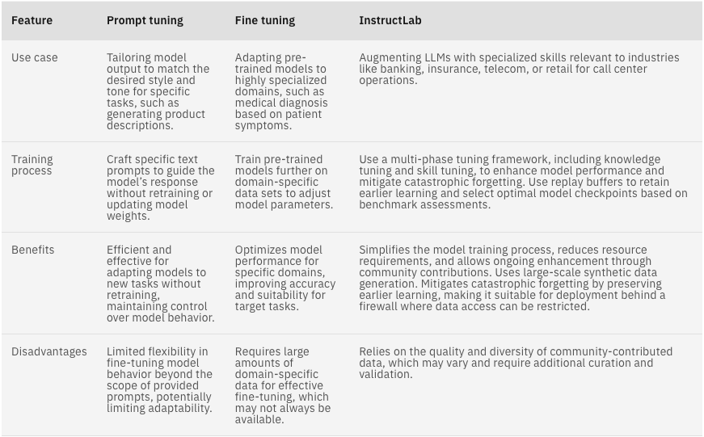

# Ways to tune an LLM
## Fine Tuning / RAG / InstructLab Method

There are three approaches for model adaptation:
*taken from* [What is InstructLab and why do developers need it?](https://developer.ibm.com/articles/awb-instructlab-why-developers-need-it/)
by [Syeda Ameena Begum]

**Prompt tuning** – Adjusts large foundational models for new tasks using soft prompts integrated with data. Models’ weights are frozen.
**Fine tuning** – Optimizes the performance of pre-trained models for specific tasks by updating model parameters.
**InstructLab** – Enhances large language models by combining taxonomy-driven data curation, large-scale synthetic data generation, and a multi-phase tuning framework. Prevents catastrophic forgetting using a replay buffer mechanism.

Let’s explore each method to determine the ideal choice for different scenarios. See the following table.

