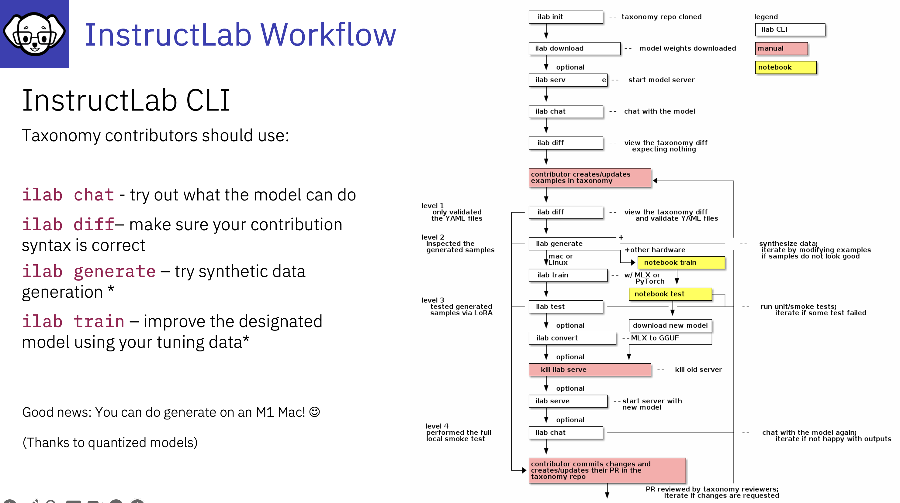

# 9 Simple steps to train an LLM with InstructLab

1. Identify the gap in knowledge/skills
2. Collate data
3. Create qna.yaml fine
4. Create the attribution file
---
5. run **ilab taxonomy diff** to check for new information in the InstructLab Taxonomy
6. run **ilab generate** to create SDG
7. run **ilab train** to train your model 
7. run **ilab test** to run a smoke test
8. run **ilab convert** to create a new GGUF file
---
Now you can serve your new model and chat with the new knowledge and skills

---

