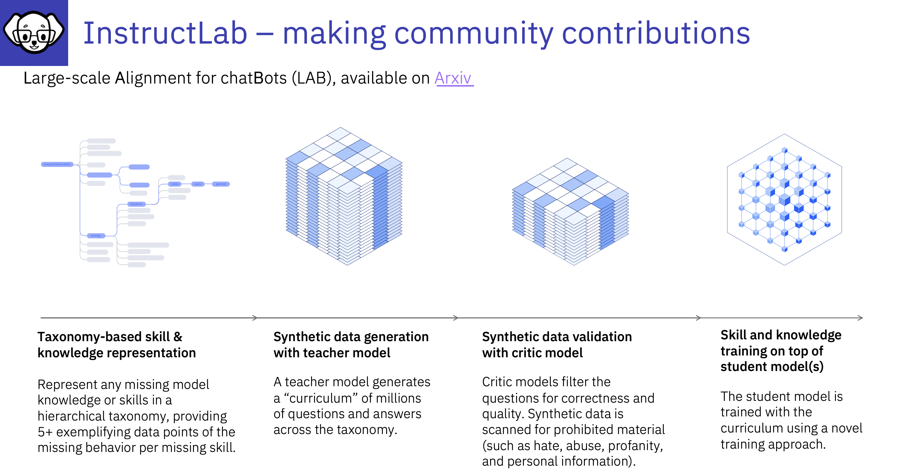

# The LAB Paper

## :bulb:Large-scale Alignment for chatBots (LAB) Concepts

A faster, systematic way to train large language models for the enterprise!

---

The Methodology behind InstructLab
:bulb:**A method to enable community-driven development and model evolution**

IBM’s new synthetic data generation method and phased-training protocol allows enterprises to update their Language Models with task-specific knowledge and skills, taking some of the guesswork out of training generative AI models.

IBM has a new solution: Large-scale Alignment for chatBots, or LAB. It is a method for systematically generating synthetic data for the tasks you want your chatbot to accomplish, and for assimilating new knowledge and capabilities into the foundation model, without overwriting what the model has already learned. With LAB, Language Models can be drastically improved in far less time and at a lower cost than is typically spent training Language Models.

[Read this blog](https://research.ibm.com/blog/LLM-generated-data)
A faster, systematic way to train large language models for enterprise by Kim Martineau, to understand more about the LAB methodology. 

[Link to the Lab Paper](https://arxiv.org/abs/2403.01081)