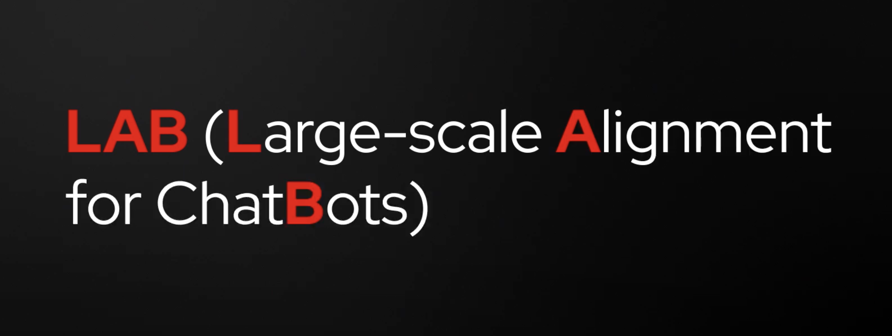

# The LAB Paper

## High-level overview of the LAB paper (video)

- ## Taxonomy based approach (as opposed to a blender approach)
- ## Synthetic Data Generation - with a Teacher Model
- ## Critic Model - to check the accuracy of the Synthetic Data
- ## Student Model training

We will cover the topic's in the video during this course, but if you want to revisit later here is the link to the YouTube video:
[Link to the video - The Technology behind InstrucLab, a low-cost way to customize LLM's](https://youtu.be/_kbq-npuMC0?si=F6FUVsk2GGLrgmrn)

IBM and Red Hat\'s new open source project is designed to lower the cost of customizing Language Models by allowing end users, subject matter experts, and enterprises to collaboratively add new knowledge and skills to AI language models which democratize AI building for everyone.

\"Instead of having a large company decide what your model knows, and what it can do, InstructLab lets you dictate through its taxonomy what knowledge and skills your model should have\" Akash Srivastava, the IBM researcher who led the team that developed LAB Method and is now principal AI product advisor at Red Hat.

Watch the following video by Máirín Duffy to understand more the concepts.

