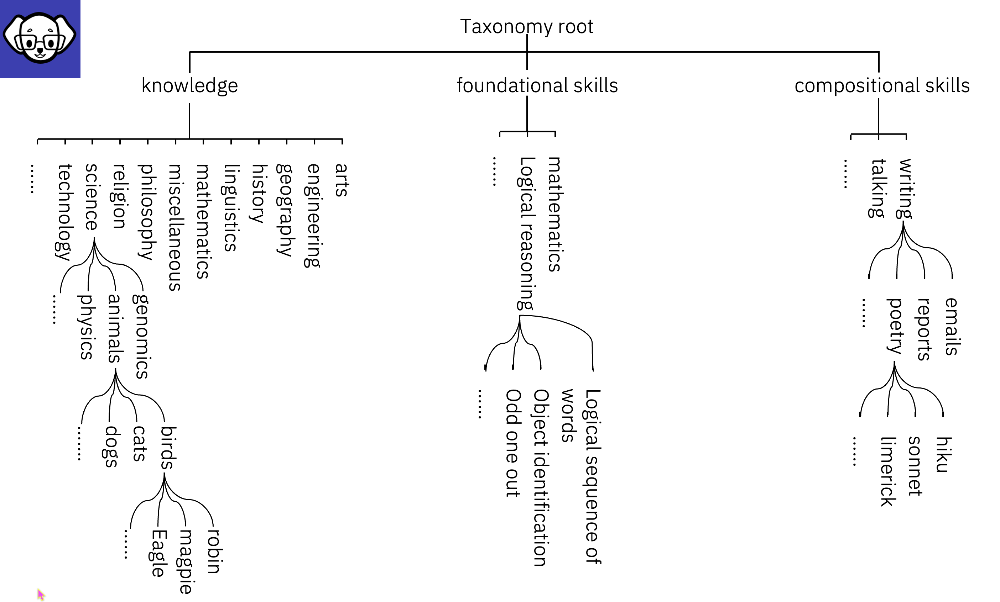

# InstructLab Taxonomy

# :bulb: The InstructLab LAB Method:
### - Is driven by taxonomies
which are largely created manually and with care.

### - The taxonomy tree categorizes knowledge
It helps you identify where knowledge should go, identify gaps in training data, and is customizable. Knowledge is added to the lowest level of the taxonomy, to the **leaf nodes**.

### - InstructLab has a repository that contains the taxonomy tree (hierarchical map) 
This allows you to create models tuned with your data (enhanced via synthetic data generation) using the LAB 🐶 method.

## - When used by an organization for a private LLM/SML the taxonomy is customizable
You can create private taxonomies in a structure that fits with the organization's own ontology - the taxonomy is flexible below where you split the tree for Knowledge and Skills. 

## - When contributing Knowledge or Skills back to the community, you should add to the Taxonomy system following the [Dewey Decimal Classifications DDC](https://www.oclc.org/content/dam/oclc/dewey/resources/summaries/deweysummaries.pdf)

For more information on the Taxonomy please refer to the [InstructLab github page](https://github.com/instructlab/taxonomy?tab=readme-ov-file#taxonomy-tree-layout)