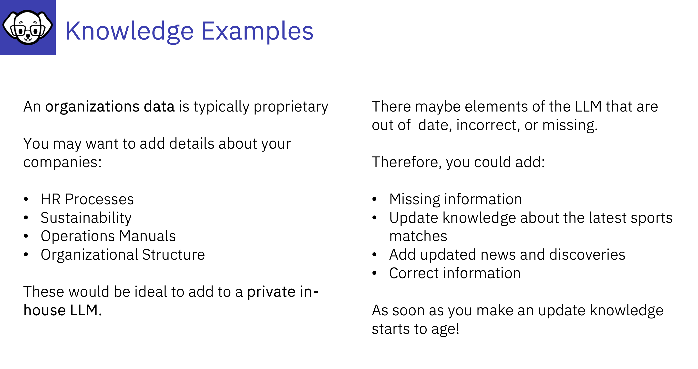

# Knowledge Examples

**:bulb: - For organizations, InstructLab provides a way to customise and infuse their in-house LLMs with their own specific business use cases.**
**- Having a customised LLM (that you have updated with InstructLab to add company specific data to) can mean that creating Agentic Solutions, Chatbots, Assistants, becomes a much faster process as the company information is available in that organisations private LLM/SLM**
