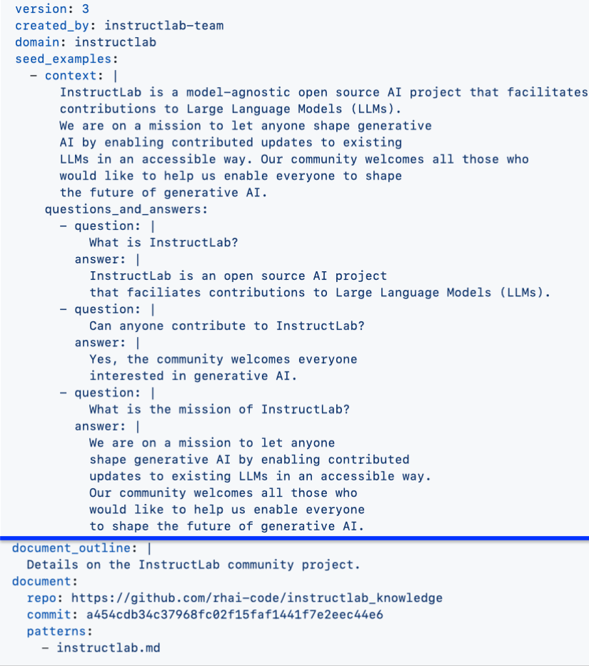

# Knowledge qna.yaml file

# Hints and Tips

1. The information you put into your Question and Answer must relate to your context information.  

For example, if you ask **"What is InstructLab" as your question?"**
and 
your example answer is **"InstructLab is an open source AI project that facilitates contributions to Large Lanagueage Models (LLMs)."**
then
All of that information should be held in the context.