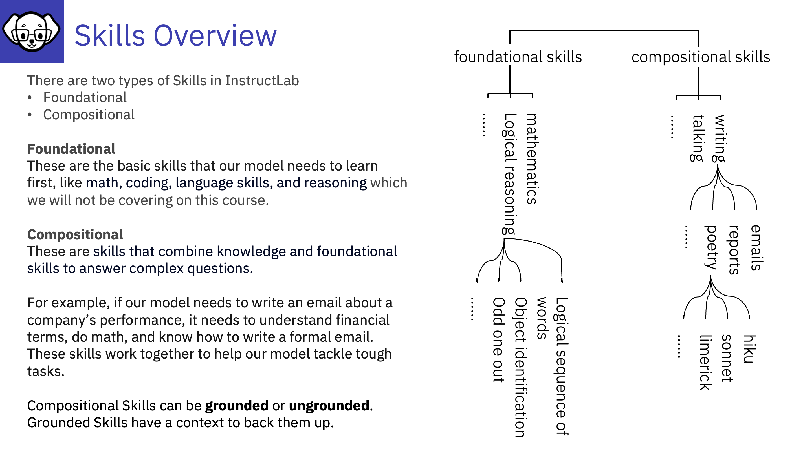

# Skills Overview

Link to more details on skills and knowledge q&a 

---
## More details on Foundational Skills:

These are the basic, core skills that an LLM needs to learn before tackling more complex tasks. 
Examples include:
**Math**: Performing calculations, solving equations, etc. 
**Coding**: Understanding and generating code in various languages 
**Language**: Grammar, vocabulary, sentence structure, etc. 
**Reasoning**: Drawing logical conclusions, problem-solving, etc. 

InstructLab uses publicly available datasets to teach these foundational skills. Unlike knowledge and compositional skills, core skills are not something you can contribute to the tree.

[What is InstructLab and why do developers need it?](https://developer.ibm.com/articles/awb-instructlab-why-developers-need-it/)
