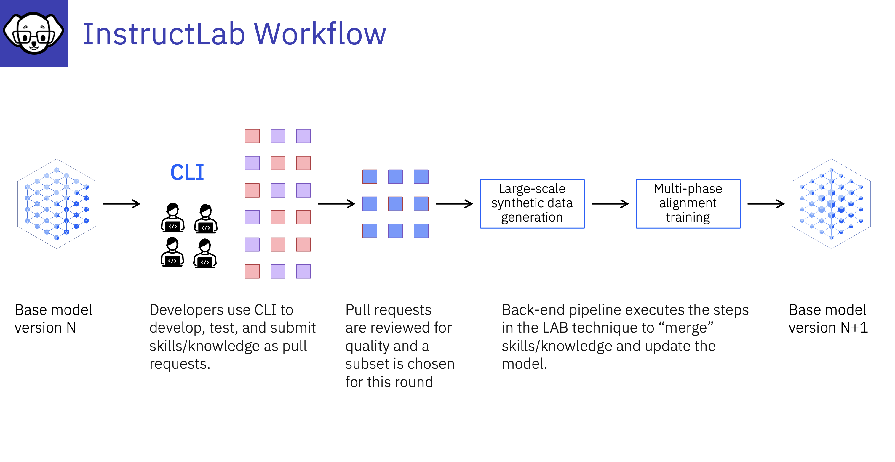

# :bulb:How to contribute new knowledge to a model using InstructLab

**Tutorial** ["Contributing knowledge to teh opensource Granite model using InstructLab](https://developer.ibm.com/tutorials/awb-contributing-knowledge-instructlab-granite/) by [Ahmed Azraq](https://developer.ibm.com/profiles/ahmed.azraq)

1. Install InstructLab
2. Fork the taxonomy from GitHub so that you can update it
3. Initialize InstructLab
4. Add the new knowledge as Markdown on GitHub
5. Update the forked taxonomy locally adding the new knowledge
6. Generate the Synthetic Data
7. Train your model locally
8. Quantize the trained model into GGUF format
9. Serve the newly trained model and chat with it
10. Optionally, contribute the knowledge to InstructLab