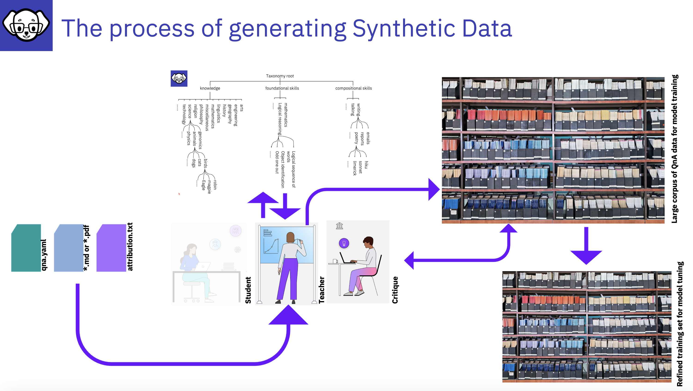
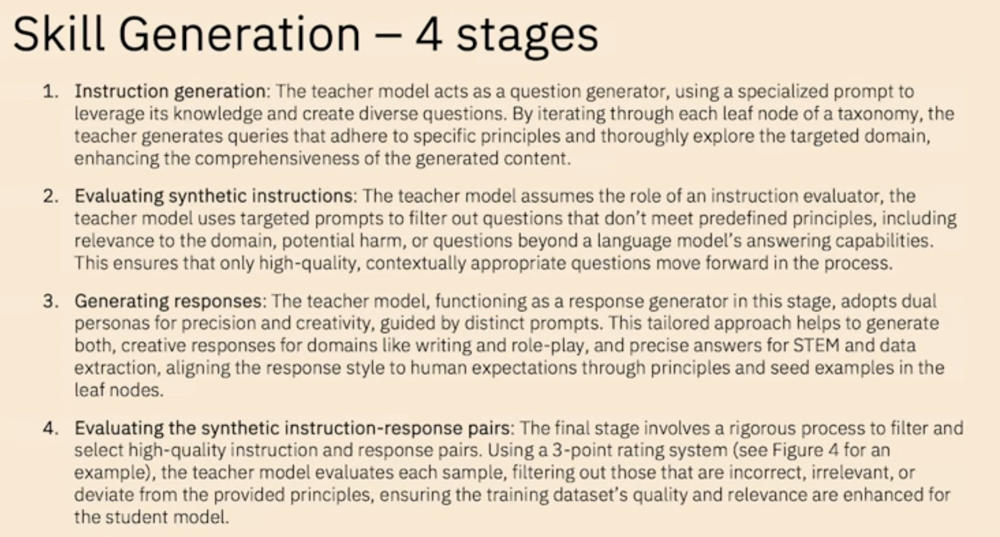
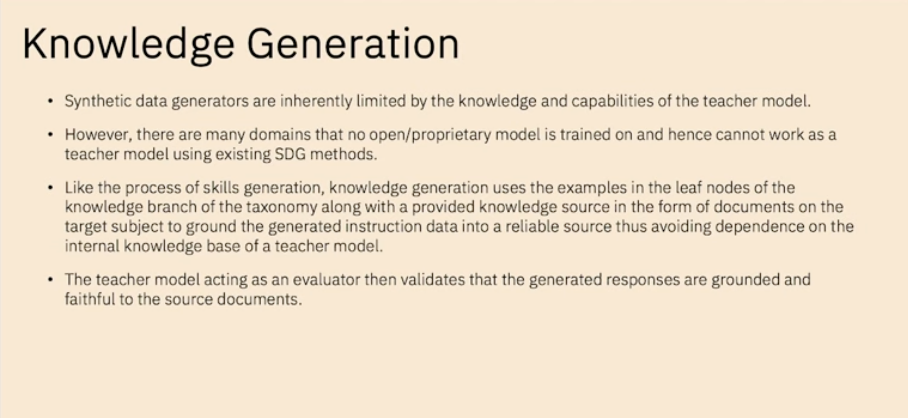

# Synthetic Data Generation Process 

Synthetic Sata Generation (SDG) 

Based on the qna.yaml questions and knowledge file/s:
- **The Teacher model** will generate a set of questions (this could be 10,000 + questions) by iterating through each leaf node of a taxonomy, the teacher model generates queries that adhere to specific principles.
- **The Critic model** then evaluates the questions from step 1 and removes the week questions.  The output is a set of quality questions.
- **The Teacher Model** then creates answers
- The Answers are evaluated by the **Critic Model**.  The output is a set of qualifying Q&A’s, with poor Q&A pairs removed

InstructLab has created your training data which you can review and then train the model with!

---
## Automated refinement

The LAB method incorporates an automated refinement process to improve the quality and reliability of synthetically generated training data. Guided by a hierarchical taxonomy, it uses the model as both a generator and evaluator. The process includes instruction generation, content filtering, response generation and pair evaluation using a 3-point rating system. For knowledge-based tasks, generated content is grounded in reliable source documents, addressing potential inaccuracies in specialized domains.

for more details [How InstructLab’s synthetic data generation enhances LLMs](https://www.redhat.com/en/blog/how-instructlabs-synthetic-data-generation-enhances-llms)
by [Cedric Clyburn](https://www.redhat.com/en/authors/cedric-clyburn), and [Legare Kerrison](https://www.redhat.com/en/authors/legare-kerrison)

---

# Back-up Materials

The following is taken from the video [Open Source Community Instruction-tuning of Language Models](https://learn.ibm.com/mod/page/view.php?id=322162&forceview=1), with [BJ Hargrave](https://www.linkedin.com/in/bjhargrave/)

1. InstructLab leverages a Teacher Model to generate new Question and Answer pairs (based on the seed examples in the qna.yaml file supported by any documents *.md, and *.pdf)
    - The training does not use knowledge stored by the Teacher Model
    - The method utilizes particular prompt templates that dramatically expand the dataset
    - InstructLab makes sure that the new examples maintain the structure and intent of the original human-curated data 

:bulb:

- with a Taxonomy model it is feasible to ensure that the q&a examples are flattened out during the SDG process across all topics, so your data is not skewed.  Additionally, you want to avoid having a peak of data in an area where the Teacher model has excellent knowledge, so always consider your seed questions carefully.  The SDG process will work to normalizes the synthetic data across different taxonomy nodes. 
- providing a good distributed set of data in the input will promote this.

---

## Stages of Skill generation
1. Questions - the teacher will generate a set of questions
2. The critic model must then evaluate the question in step 1 and weed out the week questions
** output is a set of quality questions**
3. The teacher then creates answers 
4. The Answers are then evaluated by the critic model. 
** output is a set of quality questions**

---

## Knowledge Generation 
The questions and answers are grounded in documents. Then we go through to generating Q&A phase
1. Questions - the teacher will generate a set of questions
2. The critic must then evaluate the question in step 1 and weed out the week questions
** output is a set of quality questions**
3. The teacher then creates answers 
4. The answers are then evaluated by the critic model. 
** output is a set of quality questions**

---

 Refer to ['Large-scale synthetic data generation' section of What is InstructLab and why do developers need it by Syeda Ameena Begum](https://developer.ibm.com/articles/awb-instructlab-why-developers-need-it/#large-scale-synthetic-data-generation2)

