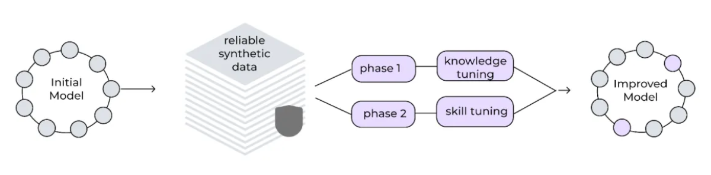

# Multi-phase tuning framework

:bulb:InstructLab implements a multiphase training process to incrementally improve the model's performance whilst preserving previously learned. This phased approach helps maintain training stability and a replay buffer of the data prevents catastrophic forgetting, allowing the model to continuously learn and improve. 

Training happens in 2 phases 
1. **Knowledge** - which is split into two steps:
    - Knowledge with short responses
    - knowledge with long responses

This phase integrates new factual information, divided into training on short responses followed by long responses and foundational skills

2. **Compositional Skills**
This phase enhances the model's ability to apply knowledge across various tasks and contexts for compositional skills

**:bulb:Replay buffers** are used to replay training data from previous steps during the current training step **to avoid catastrophic forgetting**

---

### The framework uses small learning rates, extended warm-up periods and a large effective batch size for stability.

### Iterative improvement cycle

The synthetic data generation process is designed to be iterative. As new contributions are made to the taxonomy, they can be used to generate additional synthetic data, which further enhances the model. This continuous cycle of improvement helps make sure that the model remains up-to-date and relevant.

for more details [How InstructLab’s synthetic data generation enhances LLMs](https://www.redhat.com/en/blog/how-instructlabs-synthetic-data-generation-enhances-llms)
by [Cedric Clyburn](https://www.redhat.com/en/authors/cedric-clyburn), and [Legare Kerrison](https://www.redhat.com/en/authors/legare-kerrison)

---

## Epochs and multi-phase tuning

As mentioned Instruct uses "multi-phase training that will change and repack the whole model, while the upstream InstructLab runs the “test grade” training using low-rank adaptation (LoRA) , which basically “layers” over the base model. So, how do we do the quick training?

Since we’re working on RHEL AI, we will be doing an :bulb:epoch-based training. Think of each epoch as a complete pass through the entire model. The more epochs, the higher the accuracy of the trained dataset. More epochs, of course, require more time to train the model, and after a certain point you run into diminishing returns. This being the case, start with 10 epochs. Why 10? This should be enough for testing, while staying within a reasonable time frame for training."

[InstructLab tutorial: Installing and fine-tuning your first AI model (part 2)](https://www.redhat.com/en/blog/instructlab-tutorial-installing-and-fine-tuning-your-first-ai-model-part-2) by [Rodrigo Freire](https://www.redhat.com/en/authors/rodrigo-freire)