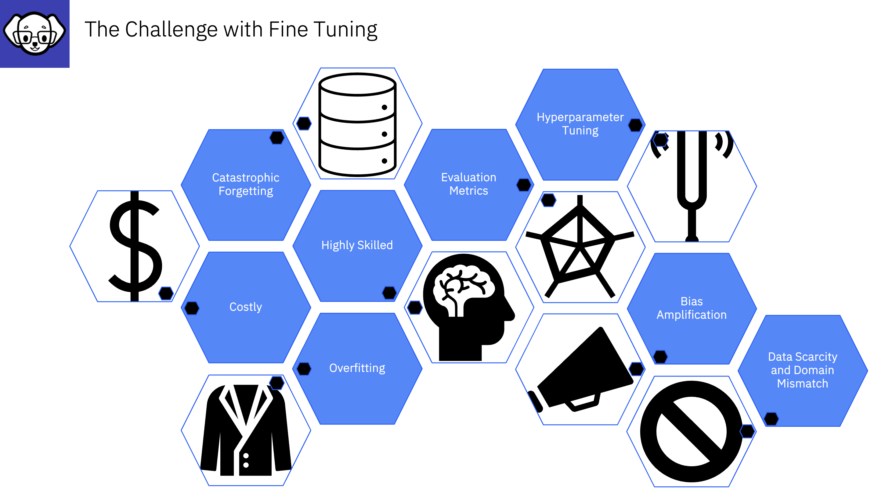

# A reminder of what InstructLab helps you avoid....

## Data Scarcity and Domain Mismatch
Finding an extensive dataset for a particular task or domain can be challenging. Which can lead to domain mismatch and subpar performance

## Catastrophic Forgetting
When you provide the model with new learning as it updates weight and focuses on the new topic it loses competence in tasks it was previously good at.  Just as we forget old information are we learn new stuff!

## Overfitting
When training on a specific topic there is always a danger the model becomes too specialized to the training data, resulting in poor generalization to new, unseen data.

## Bias Amplification
If there is bias in the training data this can get amplified in your model, you need methods and guardrails to protect against this. 

## Hyperparameter Tuning
Hyperparameter tuning is the process of optimizing the settings (hyperparameters) that control the learning process, such as the learning rate, batch size, and number of layers, to improve model performance. It's different from training the weights and biases in a language model (LLM), as those are learned during the actual training process, whereas hyperparameters are set beforehand and guide the training process.  If hyperparameter tuning is not done well it can lead to overfitting, underfitting, and slow performance of the mode. 

## Evaluation Metrics
Evaluation metrics are used to identify the performance of your LLM. These can be challenging to set and interpret; however, they are essential to identify the quality of your model. 

## **:bulb:Replay buffers** are used to replay training data from previous steps during the current training step **to avoid catastrophic forgetting**

## **Catastrophic Forgetting**
The challenge of forgetting information as you learn new information.  As weights in an LLM are altered, existing information is impacted or forgotten.  Replay buffers help prevent this by keeping old information fresh with updates from the Taxonomy as new data is added. 