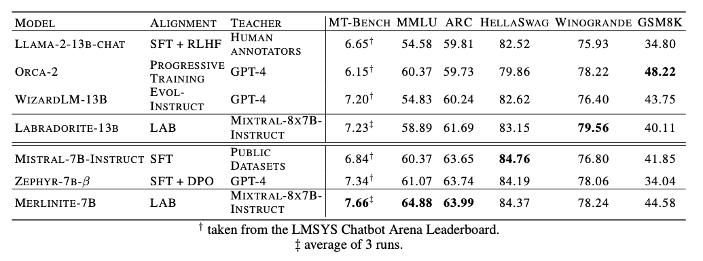

# InstructLab results and significance 

The significance of InstructLab lies in its ability to achieve state-of-the-art performance using publicly available teacher models instead of relying on proprietary models. In [benchmarks](https://arxiv.org/pdf/2403.01081), the InstructLab methodology has shown promising results. For example, when applied to Llama-2-13b (resulting in [Labradorite-13b](https://huggingface.co/ibm/labradorite-13b)) and Mistral-7B (resulting in [Merlinite-7B](https://huggingface.co/ibm/merlinite-7b)), the LAB-trained models outperformed current best models fine-tuned on their respective base models in terms of [MT-Bench](https://klu.ai/glossary/mt-bench-eval) scores. They also maintained strong performance across other metrics, including [MMLU](https://en.wikipedia.org/wiki/MMLU) (testing multitask language understanding), [ARC](https://github.com/fchollet/ARC-AGI) (evaluating reasoning capabilities) and [HellaSwag](https://rowanzellers.com/hellaswag/) (assessing common sense inference), among others.

*:bulb:The bottom-line is that InstructLab provides a cost effective, community-driven solution for improving the alignment of Language Models.*

for more details [How InstructLab’s synthetic data generation enhances LLMs](https://www.redhat.com/en/blog/how-instructlabs-synthetic-data-generation-enhances-llms)
by [Cedric Clyburn](https://www.redhat.com/en/authors/cedric-clyburn), and [Legare Kerrison](https://www.redhat.com/en/authors/legare-kerrison)
