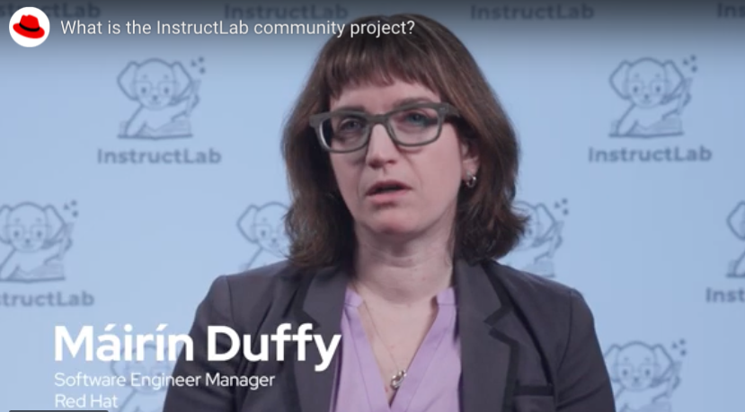

# Open Source and InstructLab

:bulb:InstructLab is an open-source project for customizing large language models (LLMs) and small language models (SLMs). Developed by IBM and Red Hat, InstructLab provides a cost-effective solution to improve alignment of language models and opens doors to those with minimal machine learning experience to contribute to customizing language models.  Community contributions to AI models become possible with InstructLab through the simple workflow and open-source licencing. 

:bulb:Join Máirín Duffy from Red Hat to explore:
- the challenge for contributors to contribute to AI model 
- how with InstructLab, we overcome contribution challenges so anyone can contribute knowledge and skills to a model
- what Makes InstructLab open-source
- how anyone can be part of this open-source community
- the benefits of community contribution from a wide range of perspectives that helps reduce bias
- Apache 2.0 licence
- open community data set

[Link to the video - "What is the InstructLab community project?"](https://youtu.be/CnHBjDfiWjo?si=YqxxTklqMrNeiFFG)