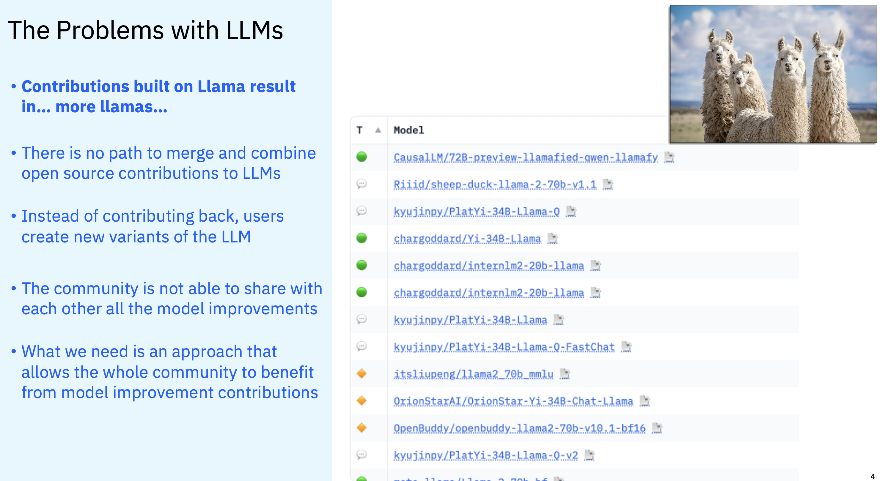

# Open Source vs Proprietary

**:bulb:Open source software (OSS)** 
- is source code developed and maintained through open collaboration 
- anyone can use, examine, alter and redistribute OSS as they see fit
- There is no licence cost - although support can sometimes be purchased for OSS
- with OSS you never have the situation that software is discontinued or lost if the vendor goes out of business, as you have access to the code through the OSS project. 
- Business who take OSS can fork the software and maintain their own branch, this is sometimes seen as a good insurance policy as the business has access to the base code. 

**:bulb:Proprietary or closed source software applications** such as Microsoft Word or Adobe Illustrator. 
- the creator or copyright holder sells the proprietary or closed source software to end users, who are not allowed to edit, enhance or redistribute the product except as specified by the copyright holder.
- typically, there is a charge for proprietary software.

[for the full article click here](https://www.ibm.com/think/topics/open-source#:~:text=With%20open%20source%2C%20the%20IP,subscription%20or%20proprietary%20license%20fee.)

---

